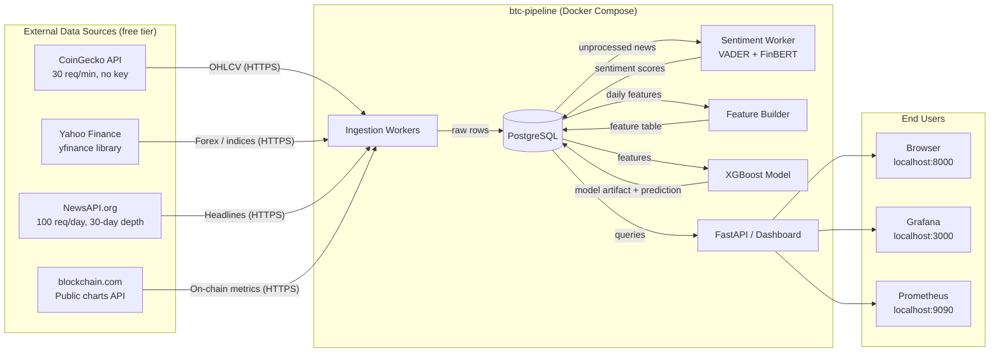
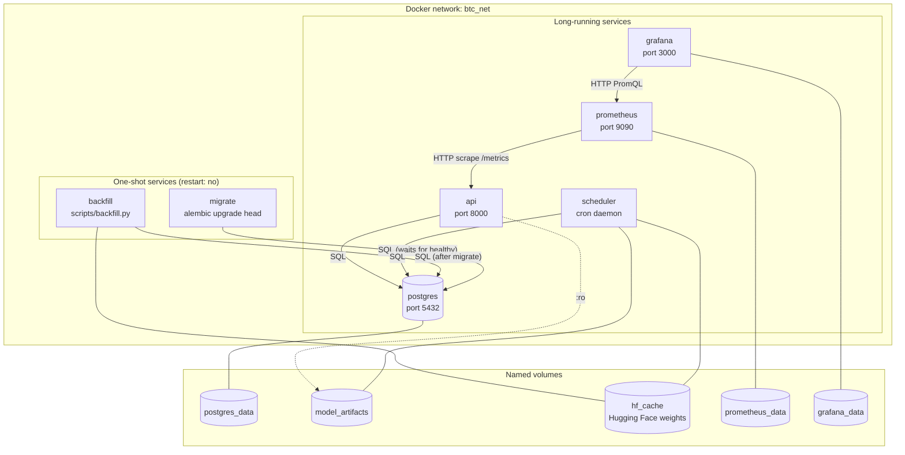
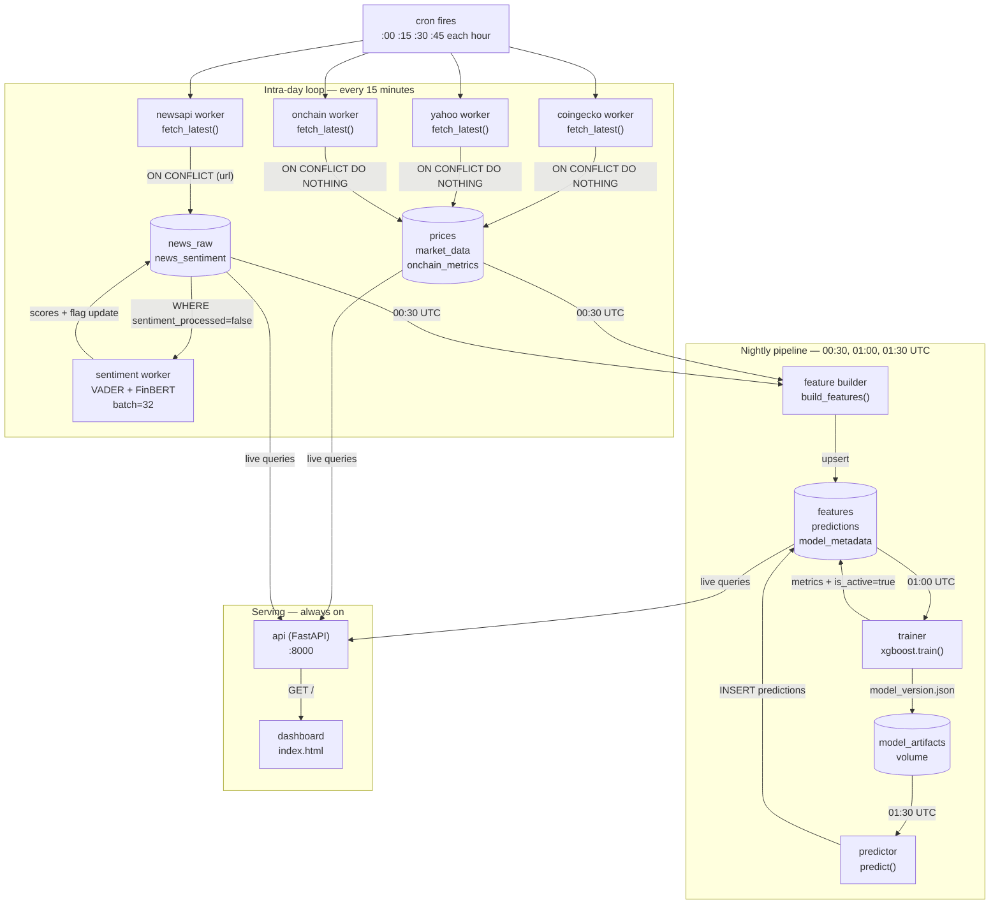
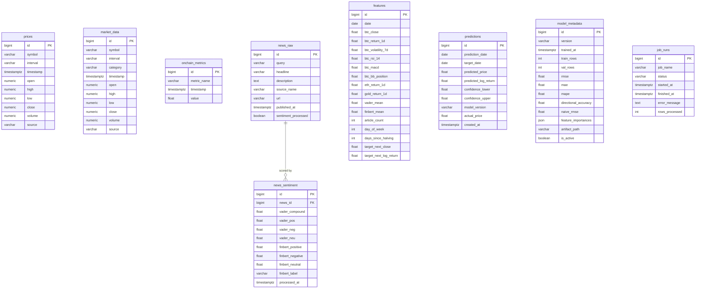
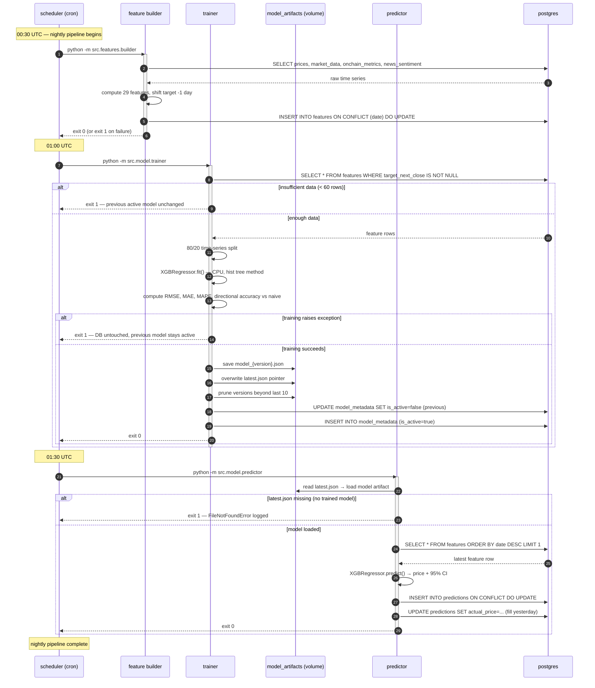
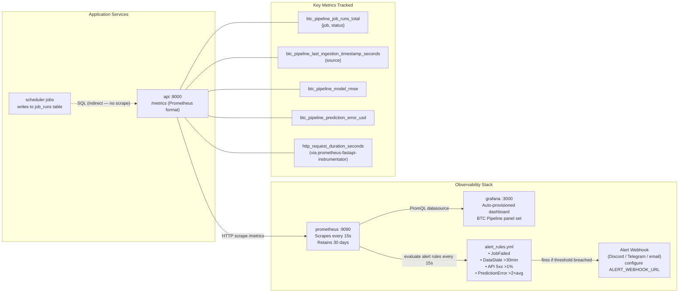
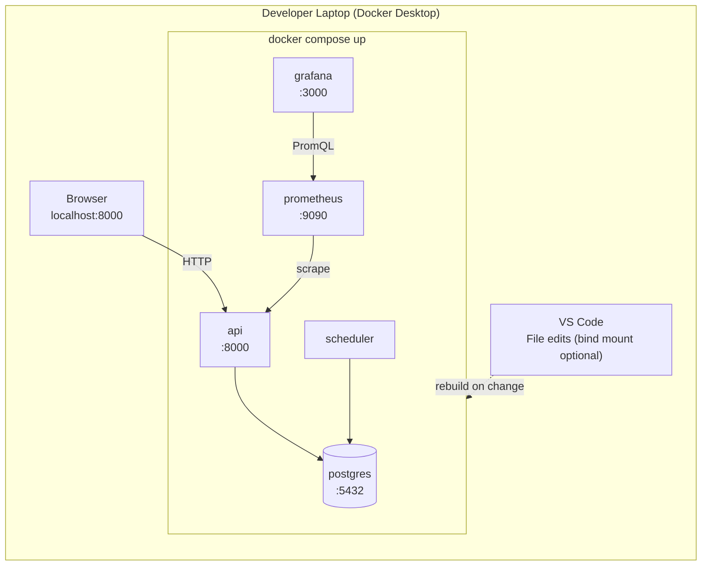
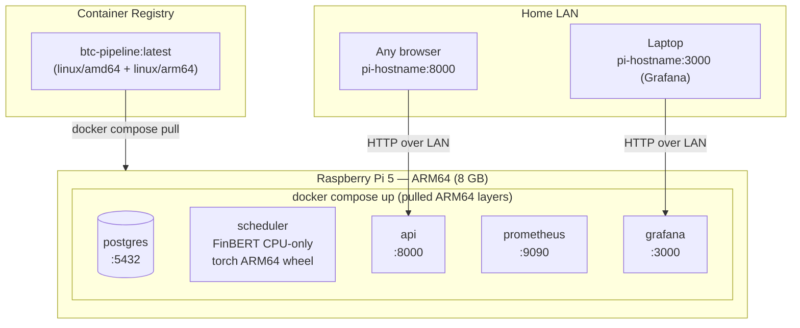

# BTC Pipeline — Architecture Reference

This document is the single source of truth for how the system is structured, how data moves through it, and how services relate to one another. Every diagram uses service names that match `docker-compose.yml` exactly. When you change the system, update the corresponding diagram in the same PR — a one-line note at the bottom tells you which diagram owns which concern.

---

## Table of Contents

1. [System Context](#1-system-context)
2. [Container Diagram](#2-container-diagram)
3. [Data Flow](#3-data-flow)
4. [Database Schema](#4-database-schema)
5. [Scheduling Timeline](#5-scheduling-timeline)
6. [Model Training and Prediction Sequence](#6-model-training-and-prediction-sequence)
7. [API and Dashboard Request Flow](#7-api-and-dashboard-request-flow)
8. [Observability Flow](#8-observability-flow)
9. [Deployment Topology](#9-deployment-topology)
10. [Updating These Diagrams](#updating-these-diagrams)

---

## 1. System Context

This diagram answers: *"What external systems does the pipeline touch, and who consumes its output?"* The application sits between free-tier external APIs (left) and the end-user dashboard (right). Nothing inside the container boundary requires paid credentials except `NEWS_API_KEY`; everything else is anonymous. The boundary also clarifies what is *not* our problem — rate limiting, availability, and schema changes on the external APIs are outside our control and are handled defensively with retries and graceful degradation.



---

## 2. Container Diagram

This diagram answers: *"Which Docker services exist, how do they communicate, and which volumes does each one own?"* Every service shares the `btc_net` Docker network, so they resolve each other by service name. One-shot services (`migrate`, `backfill`) are shown with dashed borders — they exit when done and are never restarted. Named volumes are shown as cylinders; a service that mounts a volume in read-only mode is marked `:ro`.



---

## 3. Data Flow

This diagram traces a complete data journey: from a cron tick that fires every 15 minutes all the way to a prediction rendered on the dashboard. Reading top-to-bottom, you can see two distinct cadences: the **intra-day loop** (everything above the dashed line) repeats every 15 minutes, while the **nightly pipeline** (below the dashed line) runs once per day after midnight UTC. The dashed boundary makes it obvious that the model can only improve once per day, even though fresh price data arrives continuously.



---

## 4. Database Schema

This ER diagram shows every table and all meaningful relationships. The `features` table is wide (29 columns) — only representative columns are shown; refer to the Alembic migration `001_initial_schema.py` for the full list. A design note: `forex`, `commodity`, and `index` instruments share a single `market_data` table distinguished by a `category` column, rather than three separate tables. This simplifies join patterns in feature engineering at the cost of a slightly wider index scan per category filter; the tradeoff is documented in the README.



---

## 5. Scheduling Timeline

This Gantt chart shows the daily cron schedule. The first two blocks represent two consecutive 15-minute ingestion windows to make the stagger pattern visible — in reality this pattern repeats 96 times per day. Workers are offset by 2 minutes to prevent simultaneous API calls that would breach free-tier rate limits. The nightly pipeline runs sequentially: the feature builder must complete before the trainer starts, and the trainer must complete before the predictor runs. The 30-minute gap between trainer start (01:00) and predictor start (01:30) is intentional slack — on a Raspberry Pi 5, XGBoost training on 5+ years of daily data typically completes in under 5 minutes, but FinBERT backfill during the sentiment step can take longer on first run.

```mermaid
gantt
    title Daily Cron Schedule (UTC)
    dateFormat HH:mm
    axisFormat %H:%M

    section Window :00 (repeated ×96/day)
    coingecko           :cg0, 00:00, 1m
    yahoo               :yf0, 00:02, 1m
    newsapi             :na0, 00:04, 1m
    onchain             :oc0, 00:06, 1m
    sentiment worker    :sw0, 00:08, 3m

    section Window :15 (pattern repeat)
    coingecko           :cg1, 00:15, 1m
    yahoo               :yf1, 00:17, 1m
    newsapi             :na1, 00:19, 1m
    onchain             :oc1, 00:21, 1m
    sentiment worker    :sw1, 00:23, 3m

    section Nightly Pipeline (sequential, depends on prior step)
    feature builder     :crit, fb, 00:30, 20m
    trainer             :crit, tr, 01:00, 25m
    predictor           :crit, pr, 01:30, 5m
```



---

## 6. Model Training and Prediction Sequence

This sequence diagram covers the nightly model lifecycle, including the critical failure branch. The key invariant is that **the active model never regresses to an untrained state**: if training fails, the database retains the previous `is_active=true` row and the predictor simply reuses it. The only way to end up with no active model is on a fresh install before the first successful training run, which is why the predictor raises a clear error (`No trained model found`) rather than producing a garbage prediction.



---

## 7. API and Dashboard Request Flow

This sequence shows what happens when a user opens the dashboard. The browser first fetches the static HTML, then fires five parallel API calls to populate each panel. Each API endpoint executes a single SQL query against Postgres — there is no caching layer in the current design. If a query returns no rows (e.g., no predictions exist yet because training hasn't run), the endpoint returns HTTP 503 with a human-readable message, and the dashboard panel shows a loading placeholder rather than crashing.

```mermaid
sequenceDiagram
    autonumber
    participant B as Browser
    participant API as api (FastAPI :8000)
    participant DB as postgres

    B ->> API: GET /
    API -->> B: 200 index.html (static)

    Note over B: JavaScript fires parallel fetch() calls

    par Price panel
        B ->> API: GET /api/price/current
        API ->> DB: SELECT close FROM prices WHERE symbol='BTC' ORDER BY timestamp DESC LIMIT 1
        DB -->> API: row or empty
        alt no data
            API -->> B: 503 {"detail":"No price data available yet"}
        else
            API -->> B: 200 {"symbol":"BTC","price":...,"timestamp":...}
        end
    and Prediction panel
        B ->> API: GET /api/prediction/latest
        API ->> DB: SELECT ... FROM predictions ORDER BY prediction_date DESC LIMIT 1
        DB -->> API: row or empty
        API -->> B: 200 PredictionResponse or 503
    and Multi-asset overlay + correlation heatmap
        B ->> API: GET /api/correlations?days=90&window=30
        API ->> DB: SELECT prices (BTC+ETH), market_data, onchain_metrics, news_sentiment
        DB -->> API: time series rows
        API ->> API: pivot → pct change → rolling Pearson corr
        API -->> B: 200 {series:{...}, correlation_matrix:{...}}
    and Sentiment chart
        B ->> API: GET /api/sentiment/daily?days=60
        API ->> DB: SELECT AVG(vader_compound), COUNT(*) GROUP BY date
        DB -->> API: daily aggregates
        API -->> B: 200 [{date, vader_mean, finbert_mean, article_count}]
    and Model card
        B ->> API: GET /api/model/metadata
        API ->> DB: SELECT * FROM model_metadata WHERE is_active=true LIMIT 1
        DB -->> API: metadata row or empty
        API -->> B: 200 ModelMetadataResponse or 503
    end

    Note over B: Chart.js renders panels; auto-refresh every 5 minutes
```

---

## 8. Observability Flow

This diagram shows how metrics, dashboards, and alerts are wired together. The `api` service is the only application that currently exposes `/metrics` — all other services (scheduler, sentiment worker, etc.) write job outcome data to the `job_runs` table in Postgres rather than exposing a separate scrape endpoint. This is a deliberate simplicity tradeoff: adding per-job Prometheus exporters would require each cron job to bind a port, which is awkward for ephemeral processes. If you want richer per-job metrics in the future, consider adding a Pushgateway.



---

## 9. Deployment Topology

These two diagrams show the same Docker Compose stack in the two environments it is designed to run in. The images are identical — the only difference is the CPU architecture. Multi-arch images are built with `docker buildx` on a developer machine and pushed to a registry; the Pi pulls and runs the ARM64 layer automatically. Memory limits in `docker-compose.yml` are tuned for the Pi's 8 GB, which means they are conservative on a laptop (you may want to raise them locally if you are running other heavy workloads).

### Local development (x86\_64 / Apple Silicon)



### Raspberry Pi 5 deployment (ARM64, 8 GB RAM)



> **Pi resource notes:** `torch` is installed from `https://download.pytorch.org/whl/cpu` so no CUDA layer is pulled. Memory limits in `docker-compose.yml` cap the scheduler at 1.5 GB (headroom for simultaneous FinBERT inference + XGBoost training). The API is capped at 512 MB. Raise limits if you see OOM kills in `docker stats`.

---

## Updating These Diagrams

When you change the system, update these diagrams **in the same PR** as the code change. Here is which diagram owns which concern:

| Concern | Diagram(s) to update |
|---|---|
| Adding a new data source | §1 System Context, §3 Data Flow, §4 DB Schema (if new table), §5 Scheduling Timeline |
| Adding or renaming a Docker service | §2 Container Diagram, §9 Deployment Topology |
| Changing the DB schema | §4 Database Schema |
| Changing the cron schedule | §5 Scheduling Timeline |
| Changing training / prediction logic | §6 Model Training Sequence |
| Adding a new API endpoint | §7 API Request Flow |
| Adding new Prometheus metrics or alert rules | §8 Observability Flow |
| Changing port mappings or volume mounts | §2 Container Diagram, §9 Deployment Topology |

Mermaid diagrams render natively in GitHub pull requests, VS Code (with the Markdown Preview Mermaid Support extension), and `mdBook`. To preview locally without pushing, open `docs/ARCHITECTURE.md` in VS Code and use **Ctrl+Shift+V** (or **Cmd+Shift+V** on macOS).
